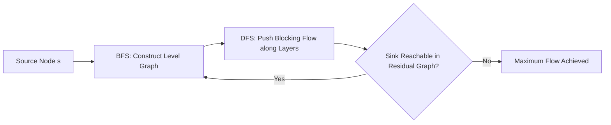

# Dinic's Max Flow Algorithm Skill

High-efficiency, zero-dependency Python implementation of **Dinic's Maximum Flow Algorithm** running in \(O(V^2 E)\) time.

## Features
- **Level Graph Construction**: BFS generates layered DAG structures to restrict search to shortest augmenting paths.
- **Blocking Flow Extraction**: DFS pushes flow along active edges with dead-end pointer pruning.
- **Zero External Dependencies**: Pure Python standard library.
- **Native MCP Protocol**: JSON-RPC 2.0 stdio server compatible with Claude Desktop, Cursor, and Windsurf.

## Architecture

